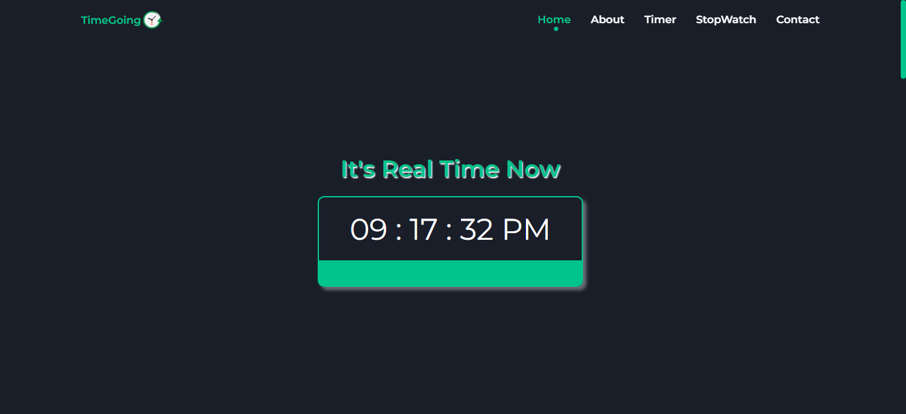

# CodeClause Internship Project

  Timer & StopWatch project

## Table of contents

- [Overview](#overview)
  - [The challenge](#the-challenge)
  - [Screenshot](#screenshot)
  - [Links](#links)
- [My process](#my-process)
  - [Built with](#built-with)
- [Author](#author)

## Overview

### The challenge

Users should be able to:

- View the optimal layout for the interface depending on their device's screen size
- See hover and focus states for all interactive elements on the page
- **Bonus**: Toggle the mobile menu (requires some JavaScript)
- Timer
- stopWatch 
- real Time 
### Screenshot

this screenshot for the home page of the website

### Links
  you can see demo live for the project from link below 
- Live Site URL: [Demo](https://mido-timerapp.netlify.app/)

## My process

### Built with

- Semantic HTML5 markup
- CSS custom properties
- javascript
- scss preprocessor for css 
- Flexbox
- responsive media query

## Author

- LinkedIn - [Milad Abdo](https://www.linkedin.com/in/mido15)

